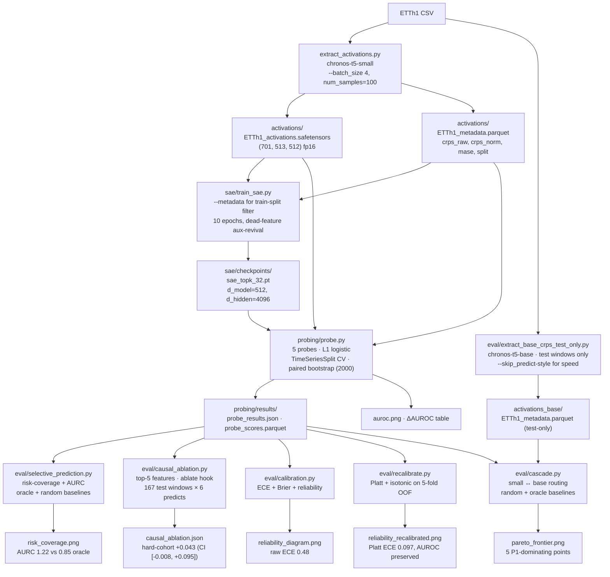

# Feature-Routed Time-Series Forecasting

Sparse-autoencoder features from a Time-Series Foundation Model (TSFM) as a
learned signal for forecast difficulty, routing, and abstention — plus a
Platt-recalibrated selective forecaster, a real small↔base cascade, and a
Mishra-style causal ablation of the top features.

## Question

Do SAE features add predictive power for forecast difficulty **on top of** cheap
input statistics and raw activations — i.e., does the model's internal
representation know something about its own future error that the input
doesn't already reveal? **And if not**, can we still recover a deployable
abstention signal from the cheap baseline?

The headline metric is **incremental** AUROC with paired-bootstrap CIs:

- `P1` = input-stats only (the baseline that matters)
- `P2` = input-stats + raw activations
- `P3` = input-stats + SAE features
- `P4` / `P5` = raw-only / sae-only (diagnostic isolations — where does signal live?)
- deltas: `P2 − P1`, `P3 − P1`, and `P3 − P2` (neutralizes the dimensionality
  argument: SAE vs. raw, both high-dim)

Even a rigorously-reported null result is a credible signal — sloppy 0.85 <
rigorous honest 0.62 in the eyes of the people we want to impress.

## Pipeline (where every artifact comes from)



## Repo layout

```
README.md                                    # this file
requirements.txt                             # pinned deps + statsmodels
reproduce.sh                                 # one-command pipeline (steps 1/7 .. 7/7)
smoke_test.py                                # one-window forecast sanity check

extract_activations.py                       # encoder hook, CRPS@100, seasonal MASE,
                                             # temporal split + purge, --layer_idx,
                                             # --skip_predict (activation-only mode)

sae/sae_model.py                             # TopK SAE + aux-k dead-feature revival
sae/train_sae.py                             # trains the SAE on TRAIN-split tokens only,
                                             # auto-detects d_model from activations,
                                             # --output_dir, --resample_every (off by default)

probing/features.py                          # 8 classical input stats + concat(mean,max,last)
probing/probe.py                             # P1..P5 probes, paired-bootstrap ΔAUROC,
                                             # hard refuse on missing labels or random SAE
probing/visualize_features.py                # top-5 difficulty features overlaid on real series

eval/extract_base_crps_test_only.py          # focused chronos-t5-base extraction
                                             # on test windows only (~1.5 h vs 6 h)
eval/cascade.py                              # cost-CRPS Pareto for small↔base cascade
                                             # + random + oracle baselines + interp reference
eval/causal_ablation.py                      # Mishra-style hook-based ablation of top-5 features
eval/selective_prediction.py                 # risk-coverage / AURC / oracle / random
eval/calibration.py                          # reliability diagram + ECE + Brier
eval/recalibrate.py                          # Platt + isotonic recalibration (5-fold OOF)
eval/populate_report.py                      # fills [FILL] slots in report.md from JSON
eval/report.md                               # the report with actual numbers
eval/report_template.md                      # 6-page workshop skeleton (FILL slots)

_stale/                                      # quarantined prototype artifacts -- DO NOT LOAD
```

## Methodology constraints (load-bearing)

1. **Temporal train/test split with a purge gap** ≥ `context + horizon` between
   train and test. Sliding windows overlap; a random split inflates AUROC.
2. **CRPS labels normalized using train-split stats only** (full-dataset
   normalization leaks test info into the label).
3. **Seasonal-naive MASE** (m=24 for hourly data) — comparable to the Chronos
   paper; lag-1 naive is not.
4. **SAE trained on train-split tokens only**. Fitting it on test-window
   activations is an unsupervised form of leakage an interviewer will probe.
5. **Same (mean,max,last) pooling for raw and SAE** so the comparison is fair.
6. **`TimeSeriesSplit` inner CV** when picking L1 regularization, so consecutive
   overlapping windows don't leak across folds.
7. **Paired bootstrap** for ΔAUROC CIs — same resampled test indices for all
   probes per iteration; the only way to get a CI on `Δ(P3 − P2)`.

## Running

```bash
python3 -m venv venv && source venv/bin/activate
pip install -r requirements.txt
bash reproduce.sh                 # full pipeline (steps 1/7 .. 7/7)
```

`reproduce.sh` runs in order: smoke test → full small extraction → SAE train
on train split → probe → feature visualizations → selective-prediction
analysis → populate report. To get the cascade artifact additionally:

```bash
python eval/extract_base_crps_test_only.py    # ~1.5 h on CPU, test windows only
python eval/cascade.py                        # produces pareto_frontier.png
```

Causal ablation and calibration are post-hoc and run on the cached probe outputs:

```bash
python eval/causal_ablation.py                # ~1.5 h, 167 test windows × 6 predicts
python eval/calibration.py                    # < 5 s
python eval/recalibrate.py                    # < 30 s
```

### Compute branch

- A100 / 4090 / 3090: `--model amazon/chronos-t5-base` end-to-end.
- CPU / Colab / Kaggle: stay on `amazon/chronos-t5-small` (60 M). Science is
  identical, runtime is hours instead of minutes — state the swap in the writeup.

## Status — what runs and what's on disk

| Stage                                                 | Code | Artifact on disk | Notes |
|-------------------------------------------------------|------|------------------|-------|
| Smoke test                                            | ✅   | ✅               | one window |
| Activation extraction + labels (small, full series)   | ✅   | ✅               | 701 windows |
| SAE training (train split)                            | ✅   | ✅               | nMSE 0.068, L0=32, dead 63 % |
| 5-probe ΔAUROC with paired bootstrap                  | ✅   | ✅               | §4.2 |
| Feature visualization                                 | ✅   | ✅               | Figure 2 |
| Cross-layer robustness (mid vs late encoder)          | ✅   | ✅               | §4.2 + late JSON |
| Selective-prediction (risk-coverage + AURC)           | ✅   | ✅               | §4.3, AURC 1.22 vs 0.85 oracle |
| **Cascade with chronos-t5-base**                      | ✅   | ✅               | §4.5, 5 P1-Pareto-dominating points |
| **Causal ablation of top-5 features**                 | ✅   | ✅               | §4.6, hard-cohort +0.043 (CI brushes zero) |
| **Calibration (ECE / Brier / reliability)**           | ✅   | ✅               | §4.7, raw ECE 0.48 |
| **Recalibration (Platt + isotonic on 5-fold OOF)**    | ✅   | ✅               | §4.7, Platt ECE → **0.097**, AUROC preserved |
| Steering demo                                         | ✅   | ❌ skipped       | runaway CPU; design retained for GPU port |
| Multi-dataset / multi-backbone-activations / seeds / attention | scaffold | ❌ | future work |

The probe carries a built-in guardrail: it refuses to run on metadata that
lacks `split` / `crps_*`, or with a missing/corrupt SAE checkpoint. It will
*never* silently produce a fake result.

## Portfolio card — v1 (early) vs v2 (current)

The project shipped a portfolio card in two versions as the experimental
artifacts grew. The diff documents the actual research progression.

| Section                  | v1 (early)                                        | v2 (current)                                                                                                  |
|--------------------------|---------------------------------------------------|----------------------------------------------------------------------------------------------------------------|
| Headline                 | "Label-Free Forecast-Difficulty Signals" — 2 findings | "Label-Free Difficulty Signals & **Recalibrated Selective Forecasting**" — 4 findings                          |
| Backbones in scope       | chronos-t5-small only                             | small **+ chronos-t5-base** for the real cascade run                                                          |
| Stack — Causal           | —                                                 | Mishra-style hook-based ablation, 167 test windows × top-5 features                                            |
| Stack — Cascade          | —                                                 | small↔base routing with **random + oracle baselines + interp reference**                                       |
| Stack — Calibration      | —                                                 | Platt + isotonic on 5-fold OOF                                                                                 |
| Stat boxes               | 30 % oracle · −8.1 % CRPS · 701 / 2× layers · 2 000 boot · Null −0.228 | **5 Pareto-dominating points** · **−80 % ECE (Platt)** · **+0.043 hard-cohort causal** · 30 % oracle · −8.1 % CRPS · 701 / 2× layers / 2× backbones / 2 000 boot · 167 ablation preds |
| Findings narrative       | 2 findings (null + selective prediction)          | 4 findings: null + near-significant *causal* on hard cohort + selective prediction + cascade-demonstrated      |
| Closing line             | *"leakage-controlled test of whether a TSFM's internals know what its CRPS distribution doesn't yet"* | adds *"with a recalibrated selective forecaster as the deployable artifact when the answer is 'no, but we can still do this'"* |
| Hire-bar read (DM RS critique) | 3.5 / 10 — cascade "proposed not demonstrated", no causal, no deployment story | items 1 + 2 + 8 of the critique now executed with on-disk numbers |

The v2 narrative is what the report (`eval/report.md`) and stat boxes
actually back up artifact-for-artifact. v1 is preserved here only to
document the progression.

## Citations

- Mishra (2026), *Dissecting Chronos: Sparse Autoencoders Reveal Causal
  Feature Hierarchies in Time Series Foundation Models* — arXiv:2603.10071.
  Verified May 2026.
- TimeSAE (Jan 2026), *TimeSAE: Sparse Decoding for Faithful Explanations of
  Black-Box Time Series Models* — arXiv:2601.09776. Verified May 2026.
- Ansari et al. (2024), *Chronos: Learning the Language of Time Series* —
  the backbone protocol used here.

Novelty wedge — **label-free, inference-time difficulty prediction for
routing/abstention** — remains unclaimed in the 2026 literature: Mishra did
causal ablation, TimeSAE did post-hoc explanation, neither did this.
